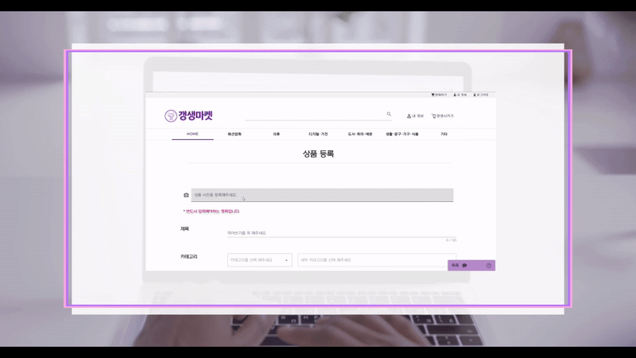
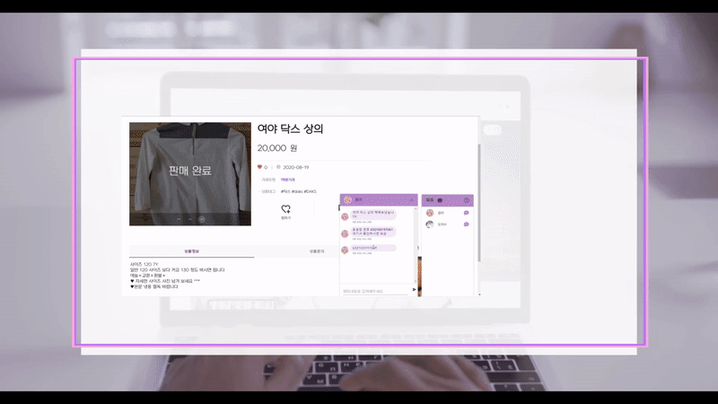

# 👛GangSangMarket👛
> 중고거래 플랫폼 갱생마켓

## Tech Stack
### Backend
- Java `12.0.2`
- Spring Boot `2.3.4`
- Spring Security `5.4.0`
- Flask `1.1.2`
- Open CV `3.4.10`
- KoNLPy `0.5.2`
### Frontend
- Vue `2.6.11`
- Vuex `3.5.1`
- vue-router `3.3.4`
- vue-axios `2.1.5`
- vue-infinite-loading `2.4.5`
- vuetify `2.3.5`
### Database
- MySQL `14.14`
- Docker  `19.3.8`
### Deployment
- NGINX
- AWS EC2

## ERD

## 👏Overview
### Social Login

### Writing Post by OpenCV

### Writing Post by KoNLPy

### Buying Item by One Click

### Chat

### Delivery Tracking

## 🧒Author👧
### 👤 Jisu, Oh
- Github: [@Jisu5](https://github.com/Jisu5)
### 👤 Hyobin, Shim
- GitLab: [@tlagyqls7](https://lab.ssafy.com/tlagyqls7)
### 👤 Seul-gi, Jin
- GitLab: [@jinpig2127](https://lab.ssafy.com/jinpig2127)
### 👤 Ji-eun, Park
- GitLab: [@wong_303](https://lab.ssafy.com/wong_303)

